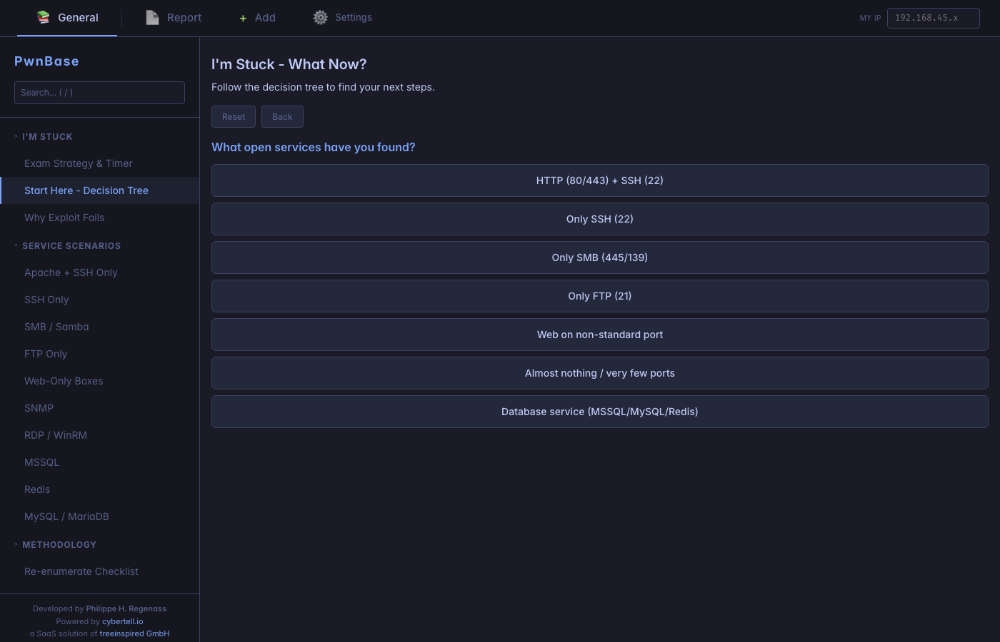
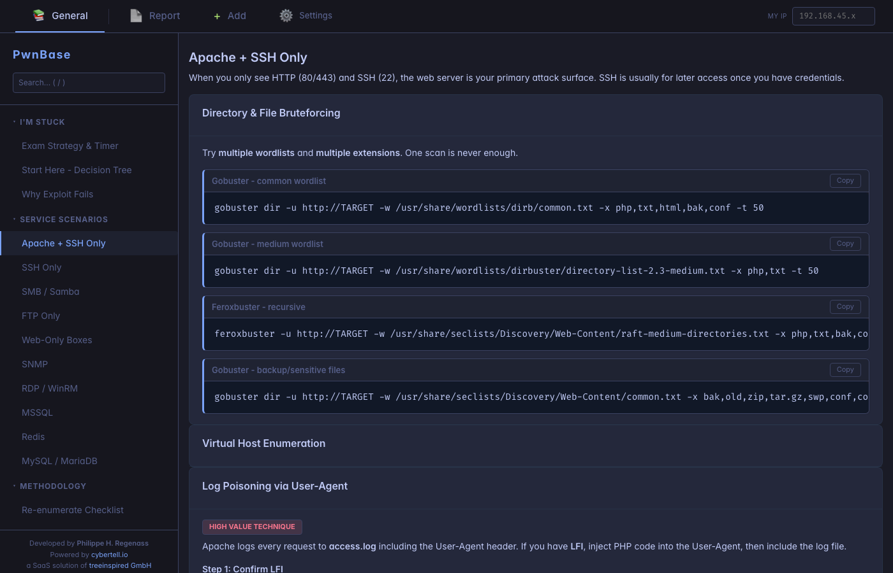
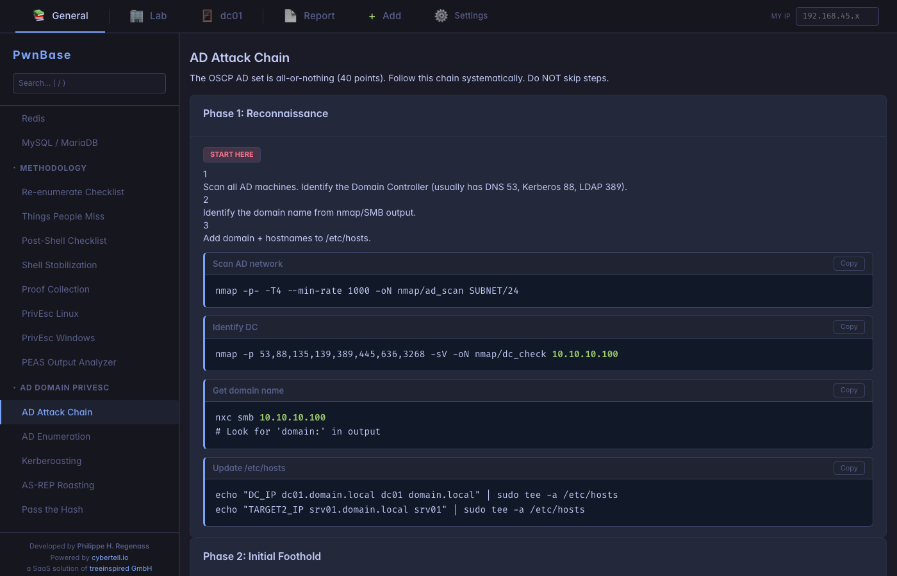
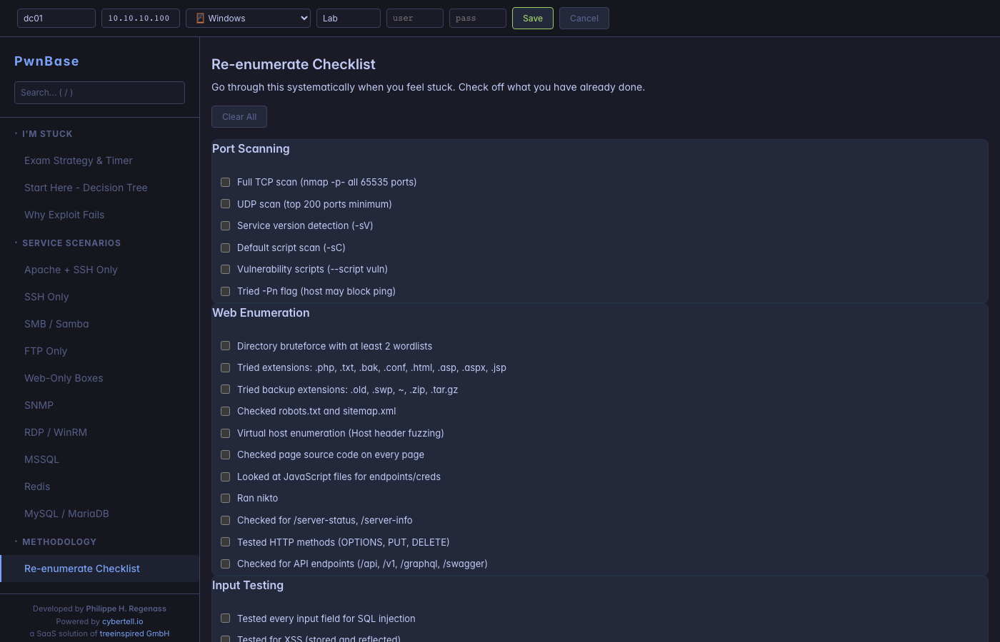
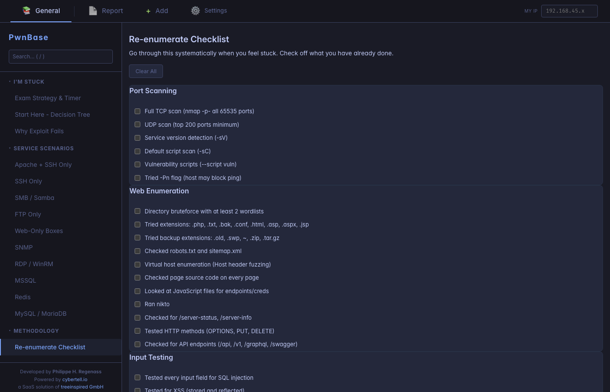
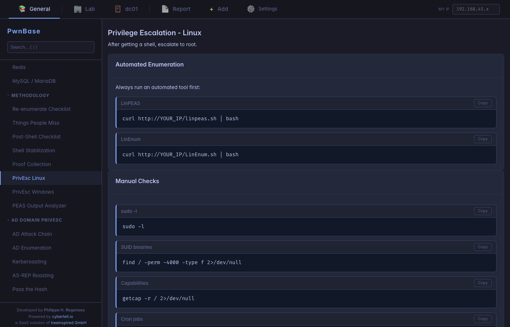
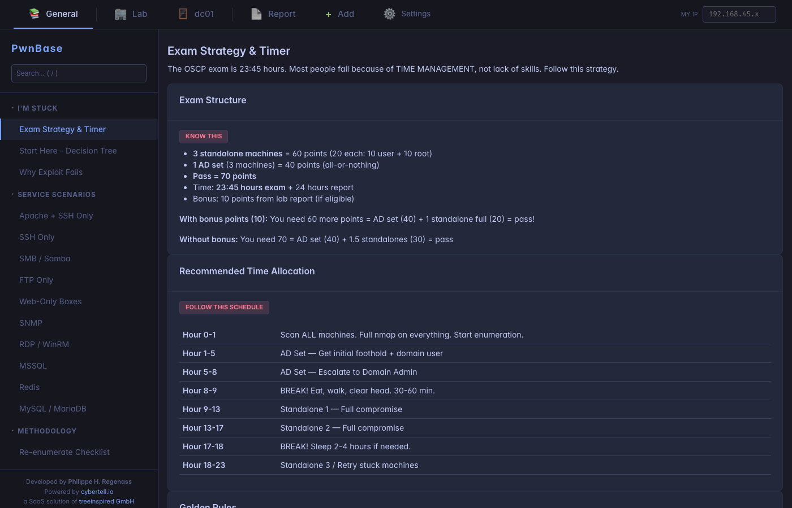
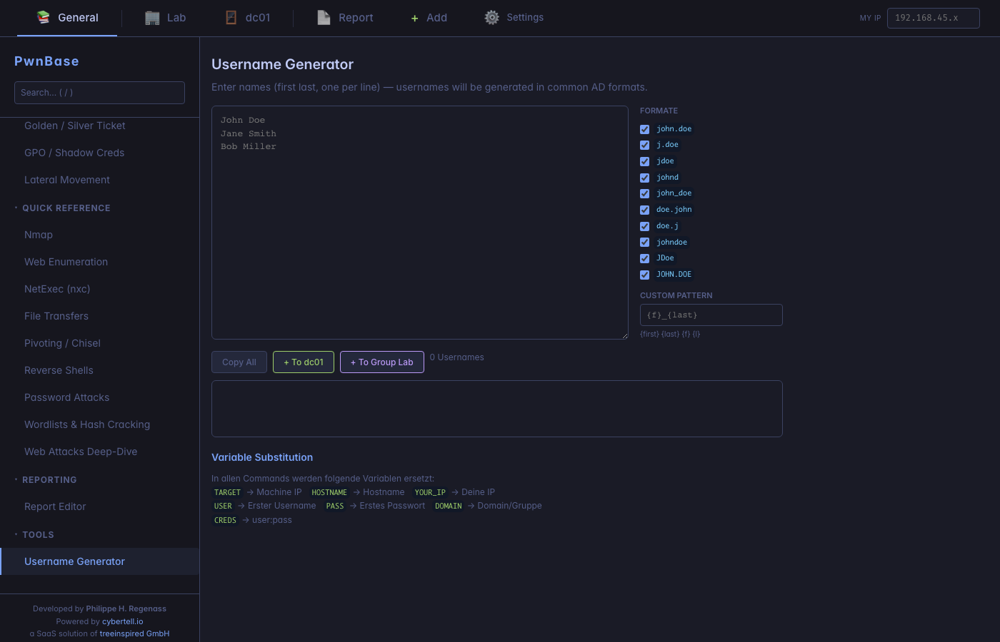
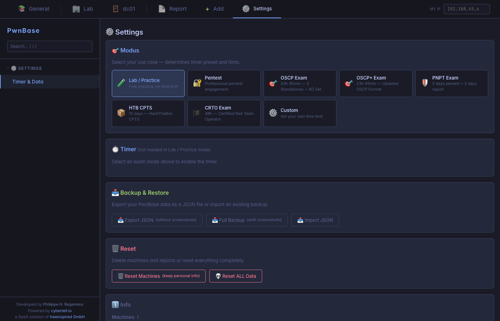

# PwnBase

A self-contained penetration testing documentation platform built for OSCP, PNPT, CPTS, and CTF engagements. Track targets, document findings, manage credentials, and generate professional PDF reports — all from a single HTML file running in your browser. **100% offline — all data stays in your browser's local storage, nothing is ever sent to a server.**



## Features

### Interactive Decision Tree

When you're stuck during an exam or engagement, the decision tree guides you to the right methodology based on the services you've discovered.


### Service-Specific Attack Guides

Step-by-step guides with copy-paste commands for common service scenarios: Apache+SSH, SMB, FTP, MSSQL, Redis, RDP/WinRM, SNMP, and more. Commands auto-substitute your target IP and port variables.



### Active Directory Attack Chain

Complete AD attack methodology from reconnaissance through domain admin, covering Kerberoasting, AS-REP Roasting, DCSync, ACL abuse, delegation attacks, NTLM relay, AD CS, golden/silver tickets, and lateral movement.



### Machine Management

Track multiple targets with hostname, IP, OS type, and group assignments. Each machine gets its own tab with a dashboard, credentials store, nmap analysis, and report editor.



### Re-enumeration Checklist

Systematic checklist covering port scanning, web enumeration, input testing, credential attacks, and post-exploitation — so you never miss a step.



### Privilege Escalation Guides & PEAS Analyzer

Linux and Windows privilege escalation references plus a built-in analyzer for LinPEAS/WinPEAS output that categorizes findings by severity.



### Exam Strategy & Timer

Built-in exam timer with visual warnings (green to amber to red) and strategy guidance for time management during certification exams.



### Username Generator

Generate username lists from extracted names in multiple formats (first.last, flast, f.last, etc.) with custom pattern support.



### Settings & Exam Profiles

Pre-configured profiles for OSCP, PNPT, HTB CPTS, OSEP, and custom exams. Export/import all data as JSON for backup and portability.



### PDF Report Generation

Export professional penetration testing reports as PDF with executive summary, findings with screenshots, remediation recommendations with severity ratings, and credential tables.

## Getting Started

### Online

Use PwnBase directly at **[pwnbase.cybertell.io](https://pwnbase.cybertell.io)** — no installation required.

### Self-Hosted

1. Clone the repository:
   ```bash
   git clone https://github.com/your-username/pwnbase.git
   cd pwnbase
   ```

2. Open `index.html` in your browser — no server, no dependencies needed.

   Or serve it locally:
   ```bash
   python3 -m http.server 8080
   ```
   Then open `http://localhost:8080`

3. Accept the ethical use disclaimer and start adding targets.

## Quick Reference Guides

PwnBase includes ready-to-use command references for:

- **Nmap** scanning techniques
- **Web Enumeration** (Gobuster, ffuf, Nikto)
- **NetExec (nxc)** for AD and SMB
- **File Transfers** (Linux/Windows)
- **Pivoting / Chisel** tunneling
- **Reverse Shells** (Bash, Python, PowerShell, etc.)
- **Password Attacks** (Hydra, John, Hashcat)
- **Wordlists & Hash Cracking**
- **Web Attacks** (SQLi, XSS, SSTI, LFI/RFI, command injection)

## Data Storage & Privacy

PwnBase runs entirely in your browser. All data is stored locally in `localStorage` — nothing is ever sent to any server. Your findings, credentials, and reports never leave your machine.

Use **Settings > Backup & Restore** to export/import your data as JSON.

## Tech Stack

- Pure HTML/CSS/JavaScript (single-file application)
- [Tabler](https://tabler.io/) UI framework with Tokyo Night dark theme
- [jsPDF](https://github.com/parallax/jsPDF) for PDF report generation
- Zero backend dependencies

## Contributing

Pull requests are welcome. For major changes, please open an issue first to discuss what you would like to change.

## Disclaimer

PwnBase is a penetration testing documentation tool designed exclusively for:

- Authorized penetration testing engagements
- Certification exams (OSCP, PNPT, CPTS, etc.)
- Lab environments and CTF challenges
- Security research with proper authorization

**Unauthorized access to computer systems is illegal. Never use this tool against systems you do not have explicit written permission to test.**

## Author

Developed by **Philippe H. Regenass**
Powered by [cybertell.io](https://cybertell.io) — a SaaS solution of [treeinspired GmbH](https://treeinspired.com)

## License

MIT License with Attribution Requirement — you are free to fork, modify, and redistribute, but any published derivative must keep the original credits visible in the footer. See [LICENSE](LICENSE) for full terms.
